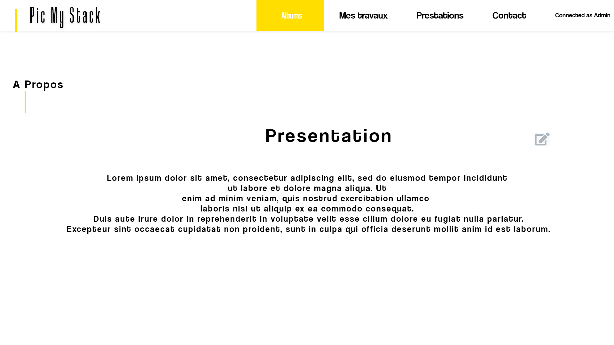

- [1. Picost](#1-picost)
  - [1.1. Picost - Web solution to organize your pictures ®](#11-picost---web-solution-to-organize-your-pictures-)
  - [1.2. Needs](#12-needs)
    - [1.2.1. Supplement needs : client account](#121-supplement-needs--client-account)
- [2. Analysis & design](#2-analysis--design)
  - [2.1. Entitys](#21-entitys)
  - [2.2. Users](#22-users)
  - [2.3. Use cases](#23-use-cases)
  - [2.4. Data base design - MySql workbench](#24-data-base-design---mysql-workbench)
  - [2.5. Visual identity](#25-visual-identity)

### 0.0.1. Project requirements

<a href="./z.conception/referenciel-projet.pdf" download="project-requirement">pdf : This is project requirements</a>

### 0.0.2. Project stack

- PostgreSql database
- Symfony - Twig - Bootstrap - jQuery
- Heroku deployment

### 0.0.3. Project dependencies

<details>
<summary>open dropdown dependencies</summary>

```json
"require": {
  "php": ">=7.2.5",
		"ext-ctype": "*",
		"ext-iconv": "*",
		"composer/package-versions-deprecated": "1.11.99.1",
		"doctrine/annotations": "^1.0",
		"doctrine/doctrine-bundle": "^2.3",
		"doctrine/doctrine-fixtures-bundle": "^3.4",
		"doctrine/doctrine-migrations-bundle": "^3.1",
		"doctrine/orm": "^2.8",
		"phpdocumentor/reflection-docblock": "^5.2",
		"sensio/framework-extra-bundle": "^5.1",
		"symfony/apache-pack": "^1.0",
		"symfony/asset": "5.2.*",
		"symfony/console": "5.2.*",
		"symfony/dotenv": "5.2.*",
		"symfony/expression-language": "5.2.*",
		"symfony/flex": "^1.3.1",
		"symfony/form": "5.2.*",
		"symfony/framework-bundle": "5.2.*",
		"symfony/http-client": "5.2.*",
		"symfony/intl": "5.2.*",
		"symfony/mailer": "5.2.*",
		"symfony/mime": "5.2.*",
		"symfony/monolog-bundle": "^3.1",
		"symfony/notifier": "5.2.*",
		"symfony/process": "5.2.*",
		"symfony/property-access": "5.2.*",
		"symfony/property-info": "5.2.*",
		"symfony/proxy-manager-bridge": "5.2.*",
		"symfony/requirements-checker": "^2.0",
		"symfony/security-bundle": "5.2.*",
		"symfony/serializer": "5.2.*",
		"symfony/string": "5.2.*",
		"symfony/translation": "5.2.*",
		"symfony/twig-bundle": "^5.2",
		"symfony/validator": "5.2.*",
		"symfony/web-link": "5.2.*",
		"symfony/yaml": "5.2.*",
		"twig/extra-bundle": "^2.12|^3.0",
		"twig/twig": "^2.12|^3.0",
		"vich/uploader-bundle": "^1.17"
	},
```

  </details>

#### 0.0.3.1. Deployment

**Deploy available on** https://app-picost.herokuapp.com/

#### 0.0.3.1. Installation

in command line, at root path.

```bash
  composer install
  symfony serve
```

# 1. Picost

## 1.1. Picost - Web solution to organize your pictures ®

A web application about pictures management, for only one user, the application's owner.

`FR dropdown version`

  <details>
<summary>voir version française</summary>
<br/>
Une application web de gestion d'images, pour un seul utilisateur, le propriétaire de l'application.
<br/>
<br/>

</details>
<br/>

## 1.2. Needs

A professional photographer asks that we create a web application for him to store, organize and show his photos as well as offer his services to the general public.

Through this tool, he wants to be able to canvass, sell, and provide the requested service to the future customer.

He wants to use this application on different media _ (computer, tablet, smartphone) _ depending on the contact he will have with his client.

He must be able to show and offer **his services** and **his work** to the general public, thus allowing him, with **a flexible and dynamic tool but also aesthetic and professional**, to canvass his clients with **a presentation of its work and its prices that it can update regularly and according to its needs.**

To show his work he usually creates **albums** by **theme** in which he groups the **photos corresponding to this theme**. This allows him to show his skills according to such or such need's client _ (ex: portraits, landscapes, events etc ...) _.

`FR dropdown version`

  <details>
<summary>voir version française</summary>
<br/>
Un photographe professionnel demande à ce qu'on lui créé une application web pour stocker, organiser et montrer ses photos ainsi que proposer ses prestations au grand public.

Il souhaite par le biais de cet outil, pouvoir démarcher, vendre, rendre la prestation demander au futur client.

Il souhaite utiliser cette application sur différent support _(ordinateur, tablette, smartphone)_ selon le contact qu'il aura avec son client.

Il doit pouvoir montrer et proposer ses prestations et ses travaux au grand public lui permettant ainsi avec un outil flexible et dynamique mais aussi esthétique et pro, de démarcher ses clients avec une présentation de ses travaux et de ses tarifs qu'il pourra mettre à jour régulièrement et selon son besoin.

Pour montrer ses travaux il a l'habitude de créer des albums par thème dans lesquel il regroupe les photos répondant à ce thème. Cela lui permet aurpès d'un client de montrer ses compétences selon tel ou tel besoin _(ex : des portraits, des paysages, des évènements etc...)_.
<br/>
<br/>

</details>
<br/>

### 1.2.1. Supplement needs : client account

To **return a photo service to a client**, he offers **a dedicated album** which groups together the photos that are specific to him.

The application therefore allows him to have **a global vision on his public albums** dedicated to prospecting and on **his private albums dedicated to customer delivery**.

Finally, he would like **his clients after services to be able to consult and retrieve their album directly on the photographer's application in a secure and private way.**

`FR dropdown version`

  <details>
<summary>voir version française</summary>
<br/>
Pour rendre une prestation de photogrpahie à un client, il propose un album dédié qui regroupe les photos qui lui sont propres.

L'application lui permet donc d'avoir une vision gobale sur ses albums publics dédiées à la prospection et sur ses albums privés dédiées à la livraison de client.

Enfin il voudrait que ses clients après prestations puissent consulter et récupérer leur album directement sur l'pplication du photographe de manière sécurisée et privée.
<br/>
<br/>

</details>
<br/>

# 2. Analysis & design

## 2.1. Entitys

- Album
- Photo
- Prestation
- User

## 2.2. Users

Wich will be applications users ?

- Photographer as admin
- Visitors and prospects consumers
- Consumers

## 2.3. Use cases


## 2.4. Data base design - MySql workbench


## 2.5. Visual identity


