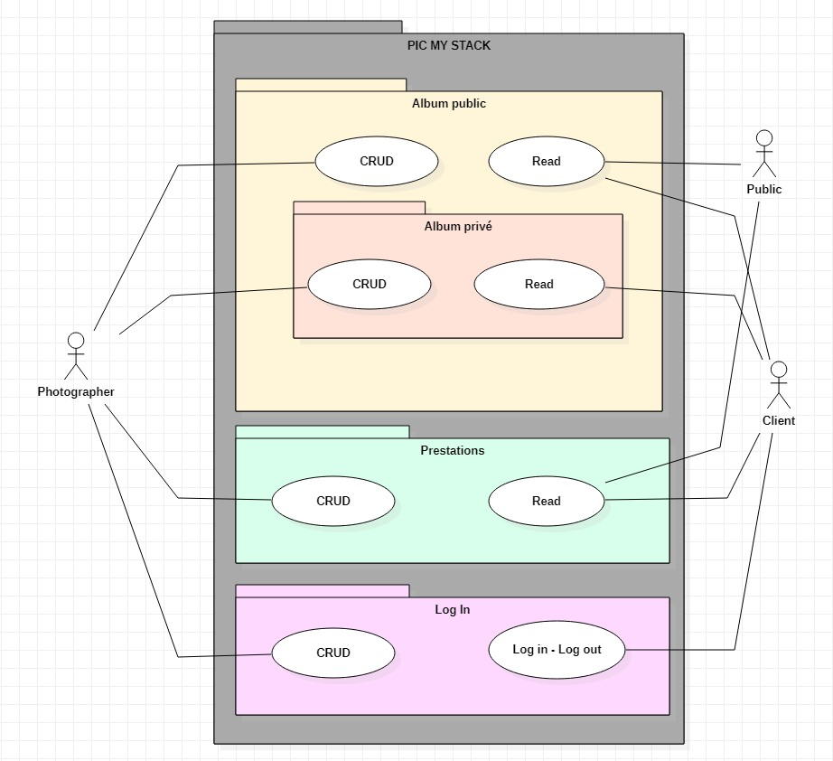
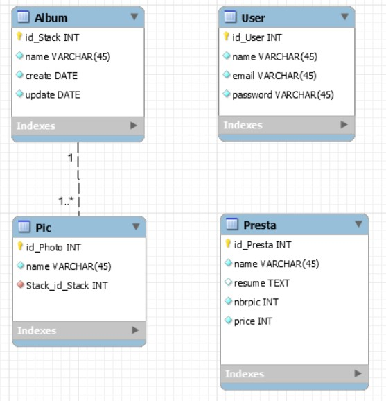

- [1. Pic My Stack](#1-pic-my-stack)
  - [1.1. Le besoin](#11-le-besoin)
    - [1.1.1. Bonus : Création de compte](#111-bonus--création-de-compte)
- [2. Analyse & Conception](#2-analyse--conception)
  - [2.1. Type de donnée](#21-type-de-donnée)
  - [2.2. Users](#22-users)
  - [2.3. Use case](#23-use-case)
  - [2.4. BDD Conception - MySql workbench](#24-bdd-conception---mysql-workbench)
  - [2.5. Maquette graphique](#25-maquette-graphique)
  - [2.6. Technologie](#26-technologie)
    - [2.6.1. Back-end](#261-back-end)
    - [2.6.2. Front-end](#262-front-end)
    - [2.6.3. Versionning](#263-versionning)
    - [2.6.4. Déploiement](#264-déploiement)


# 1. Pic My Stack

    Pic My Stack - How to pick yours stack's pictures and photos. ®

Projet de developpement web qui vise à permettre à l'utilisateur d'organiser comme il le souhaite ses photos sous forme d'album.

## 1.1. Le besoin

Un photographe professionnel demande à ce qu'on lui créé une application web pour stocker, organiser et montrer ses photos ainsi que proposer ses pretations au grand public. 

Il souhaite par le biais de cet outil, pouvoir démarcher, vendre, rendre la prestation demander au futur client.

Il souhaite utiliser cette application sur différent support *(ordinateur, tablette, smartphone)* selon le contact qu'il aura avec son client. 

Il doit pouvoir montrer et proposer **ses prestations** et **ses travaux** au grand public lui permettant ainsi avec **un outil flexible et dynamique mais aussi esthétique et pro**, de démarcher ses clients avec **une présentation de ses travaux et de ses tarifs qu'il pourra mettre à jour régulièrement et selon son besoin.**

Pour montrer ses travaux il a l'habitude de créer des **albums** par **thème** dans lesquel il regroupe les **photos répondant à ce thème**. Cela lui permet aurpès d'un client de montrer ses compétences selon tel ou tel besoin *(ex : des portraits, des paysages, des évènements etc...)*.

### 1.1.1. Bonus : Création de compte
https://symfony.com/doc/current/doctrine/registration_form.html

    Pour **rendre une prestation de photogrpahie à un client**, il propose **un album dédié** qui regroupe les photos qui lui sont dédiées.


    L'application lui permet donc d'avoir **une vision gobale sur ses albums publics** dédiées à la prospection et sur **ses albums privés dédiées à la livraison de client**.


    Enfin il voudrait que **ses clients après prestations puissent consulter et récupérer leur album directement sur l'API du photographe de manière sécurisée et privée.**

```bash
  make:user
  make:entity:user > pseudo
  make:registration-form
```

# 2. Analyse & Conception

## 2.1. Type de donnée

- Albums
- Photos
- Prestation
- Users

## 2.2. Users

Quels seront les utilisateurs de l'API ?

- Le photographe as admin
- Le public / prospect as visitor
- Le client as consumer
  
## 2.3. Use case



## 2.4. BDD Conception - MySql workbench



## 2.5. Maquette graphique

## 2.6. Technologie
### 2.6.1. Back-end
### 2.6.2. Front-end
### 2.6.3. Versionning 
### 2.6.4. Déploiement

    ## 2.7. Support de présentation client

